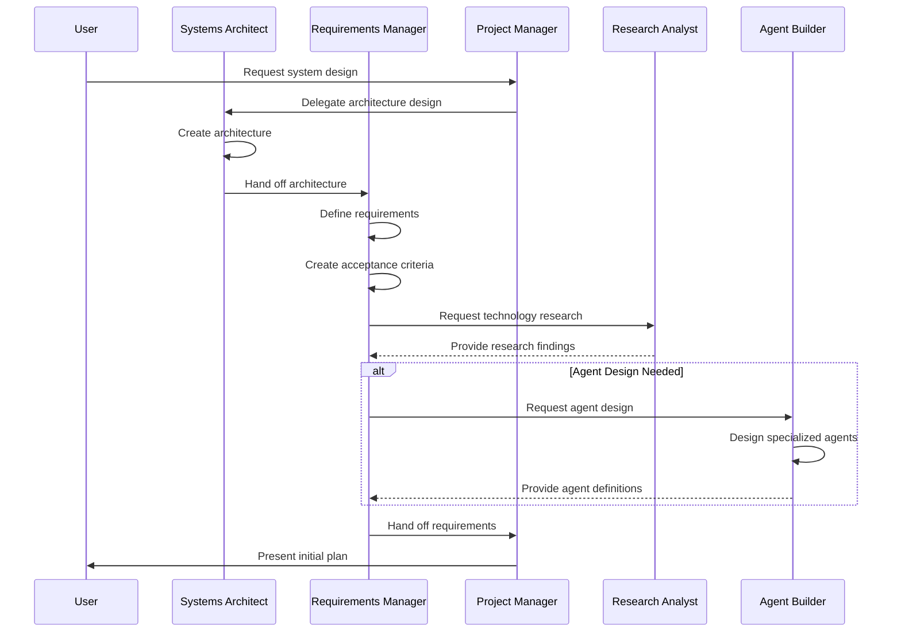
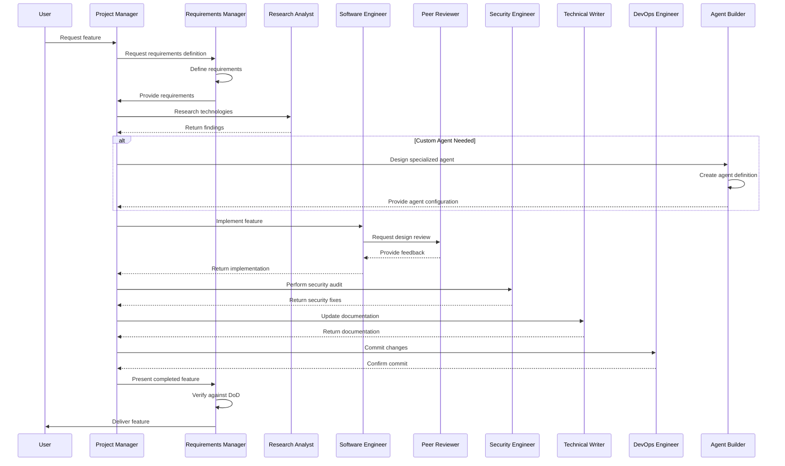
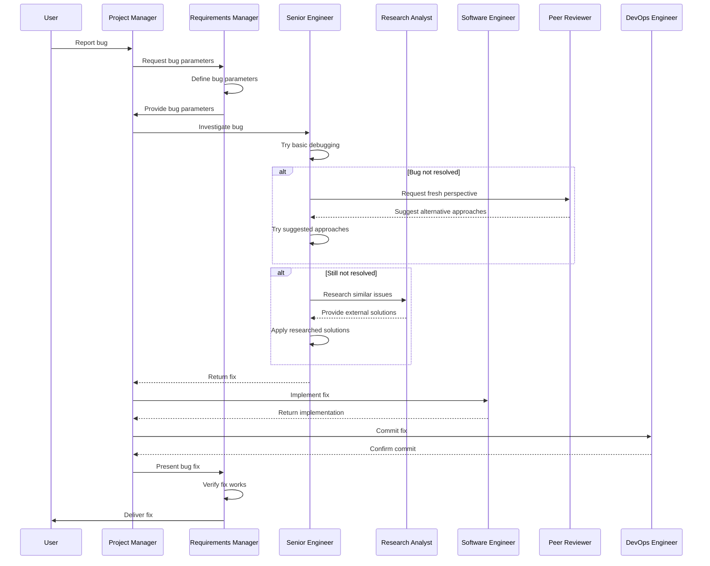
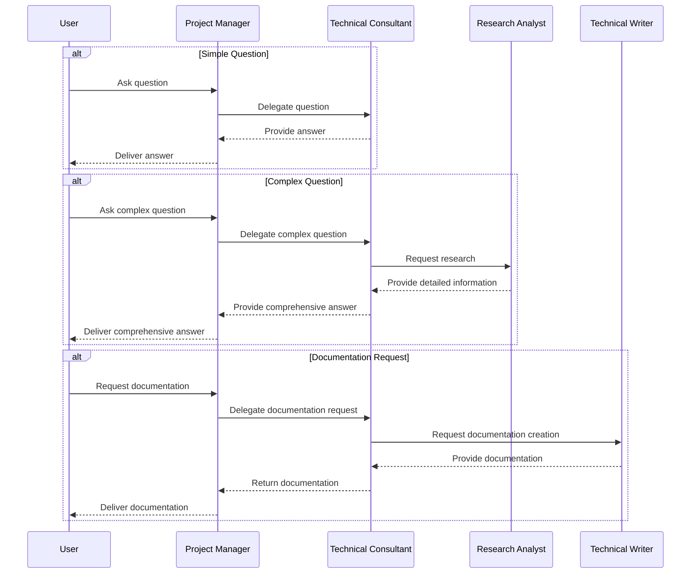
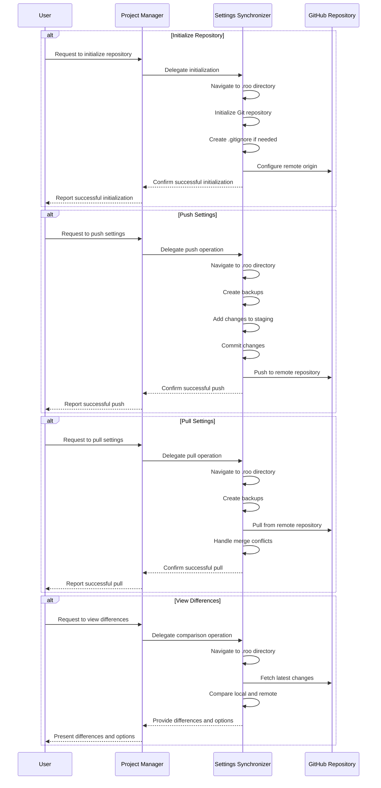

# Integrated Modes Workflow Guide

This document outlines the detailed role definitions and workflow diagrams for our integrated mode ecosystem, combining built-in modes with custom modes to create a comprehensive team structure.

## 1. Role Definitions

### 1.1 Built-in Modes (Renamed)

#### Software Engineer (formerly Code)
- **Primary Responsibility**: Hands-on implementation of code
- **Key Skills**:
  - Writing and modifying code in various languages
  - Implementing features and fixing bugs
  - Following coding standards and best practices
  - Testing and validating implementations
- **When to Use**: For direct code implementation tasks
- **Input**: Specifications, requirements, designs
- **Output**: Working code, tests, implementation documentation

#### Systems Architect (formerly Architect)
- **Primary Responsibility**: High-level system design and planning
- **Key Skills**:
  - Creating architectural designs
  - Evaluating technical approaches
  - Making technology selection decisions
  - Ensuring system scalability, reliability, and maintainability
- **When to Use**: Early in the development process when designing systems
- **Input**: Business requirements, technical constraints
- **Output**: Architecture diagrams, technical specifications, design decisions

#### Technical Consultant (formerly Ask)
- **Primary Responsibility**: Information provider and advisor
- **Key Skills**:
  - Answering technical questions
  - Explaining concepts and technologies
  - Providing factual information
  - Offering guidance and recommendations
- **When to Use**: When seeking information or guidance without implementation
- **Input**: Questions, topics for explanation
- **Output**: Explanations, information, guidance

#### Senior Engineer (formerly Debug)
- **Primary Responsibility**: Advanced troubleshooting and complex problem-solving
- **Key Skills**:
  - Diagnosing complex issues
  - Root cause analysis
  - Implementing sophisticated fixes
  - Performance optimization
- **When to Use**: For difficult bugs, performance issues, or complex technical challenges
- **Input**: Bug reports, system issues, performance problems
- **Output**: Bug fixes, optimizations, technical solutions

### 1.2 Custom Modes

#### Requirements Manager
- **Primary Responsibility**: Defining requirements and maintaining project context
- **Key Skills**:
  - Defining requirements and acceptance criteria
  - Tracking dependencies between tasks
  - Validating completion criteria
  - Ensuring proper handoffs between specialized modes
- **When to Use**: For requirements definition, tracking, and quality assurance
- **Input**: Project goals, stakeholder requirements
- **Output**: Requirements documents, acceptance criteria, status reports

#### Project Manager (Orchestrator)
- **Primary Responsibility**: Workflow coordination and task delegation
- **Key Skills**:
  - Breaking down complex tasks
  - Identifying the optimal team member or mode for each step
  - Managing transitions between team members and modes
  - Preserving context across transitions
- **When to Use**: For coordinating complex workflows involving multiple team members and modes
- **Input**: Complex tasks requiring multiple specialties
- **Output**: Coordinated workflow execution, context preservation

#### Technical Writer
- **Primary Responsibility**: Creating and managing documentation
- **Key Skills**:
  - Writing clear, concise documentation
  - Organizing information logically
  - Following documentation conventions
  - Converting technical concepts into user-friendly content
- **When to Use**: For documentation creation and maintenance
- **Input**: Technical information, code, specifications
- **Output**: User guides, technical documentation, reference materials

#### Security Engineer
- **Primary Responsibility**: Security assessment and implementation
- **Key Skills**:
  - Identifying security vulnerabilities
  - Recommending security improvements
  - Implementing security best practices
  - Performing security audits
- **When to Use**: For security-related tasks and reviews
- **Input**: Code, system designs, security requirements
- **Output**: Security assessments, security fixes, best practice recommendations

#### DevOps Engineer
- **Primary Responsibility**: Version control and deployment management
- **Key Skills**:
  - Managing Git workflows
  - Implementing effective branching strategies
  - Handling commits and merges
  - Maintaining clean commit history
- **When to Use**: For version control and deployment tasks
- **Input**: Code changes, branch management needs
- **Output**: Properly committed code, clean repositories, successful deployments

#### Research Analyst
- **Primary Responsibility**: Technical research and evaluation
- **Key Skills**:
  - Researching technologies and approaches
  - Evaluating options based on criteria
  - Summarizing findings clearly
  - Making evidence-based recommendations
- **When to Use**: When research is needed for decision-making
- **Input**: Research questions, evaluation criteria
- **Output**: Research findings, comparisons, recommendations

#### Peer Reviewer
- **Primary Responsibility**: Providing fresh perspective and feedback
- **Key Skills**:
  - Asking insightful questions
  - Reviewing code and designs critically
  - Providing constructive feedback
  - Suggesting alternative approaches
- **When to Use**: For design reviews, code reviews, or when stuck on a problem
- **Input**: Code, designs, problems to solve
- **Output**: Feedback, alternative suggestions, questions that prompt insight

#### Settings Synchronizer
- **Primary Responsibility**: Managing and synchronizing Roo settings
- **Key Skills**:
  - Managing the .roo directory as a Git repository
  - Reading and writing Roo settings files
  - Comparing local settings with repository settings
  - Pushing settings to GitHub repositories
  - Pulling settings from GitHub repositories
  - Handling merge conflicts
- **When to Use**: For synchronizing Roo settings across multiple machines
- **Input**: Settings files, GitHub repository information
- **Output**: Synchronized settings, backup files, conflict resolutions

#### Agent Builder
- **Primary Responsibility**: Designing, building, and refining custom Roo modes (agents)
- **Key Skills**:
  - Creating well-defined agent roles with clear responsibilities
  - Designing effective permission structures for agents
  - Crafting precise and actionable custom instructions
  - Understanding agent collaboration patterns and workflows
  - Leveraging MCP tools and resources in agent design
  - Optimizing agents for specific tasks and domains
  - Testing and refining agent behavior
- **When to Use**: For creating new custom modes or refining existing ones
- **Input**: Agent requirements, task specifications, collaboration patterns
- **Output**: Complete agent definitions, JSON configurations, documentation
- **Design Framework**: Six-point analysis framework:
  1. Task definition: What specific problems will this agent solve?
  2. Background/Context: What knowledge must the agent have?
  3. Limitations/Constraints: What boundaries should the agent operate within?
  4. References: What documentation or resources should the agent consult?
  5. Potential Resources/Teammates: What other agents might this one collaborate with?
  6. Acceptance Criteria: How will we know the agent is performing correctly?

## 2. Workflow Diagrams

### 2.1 Project Initiation Workflow

### 2.2 Feature Development Workflow

### 2.3 Debugging Workflow

### 2.4 Information Request Workflow

### 2.5 Settings Synchronization Workflow

## 3. Integration Points

### 3.1 Built-in and Custom Mode Integration

| Built-in Mode | Custom Mode(s) | Integration Point |
|---------------|---------------|-------------------|
| Software Engineer | DevOps Engineer | Code implementation → Version control |
| Systems Architect | Requirements Manager | Architecture design → Requirements definition |
| Technical Consultant | Research Analyst | Quick answers → Deep research |
| Senior Engineer | Peer Reviewer | Complex debugging → Fresh perspective |
| Project Manager | Requirements Manager | Workflow coordination → Requirements validation |
| All Modes | Agent Builder | Mode implementation → Agent design |

### 3.2 Key Handoff Points

1. **Systems Architect → Requirements Manager**
   - Handoff: Architecture diagrams, technical specifications
   - Verification: Requirements Manager confirms all requirements are addressed

2. **Requirements Manager → Project Manager**
   - Handoff: Requirements, acceptance criteria, project plan
   - Verification: Project Manager confirms understanding of requirements

3. **Project Manager → Specialized Modes**
   - Handoff: Specific tasks with context and requirements
   - Verification: Clear understanding of task and expected output

4. **Specialized Modes → Project Manager**
   - Handoff: Completed work with documentation
   - Verification: Project Manager validates against requirements

5. **Project Manager → Requirements Manager**
   - Handoff: Completed features or fixes
   - Verification: Requirements Manager validates against acceptance criteria

6. **Any Mode → Agent Builder**
   - Handoff: Requirements for new or improved agent
   - Verification: Agent Builder confirms understanding of agent purpose and requirements

7. **Agent Builder → Project Manager**
   - Handoff: Completed agent definition and configuration
   - Verification: Project Manager validates agent against requirements

## 4. Implementation Steps

### 4.1 Documentation Updates

1. Create mapping documentation for built-in modes:
   - Code → Software Engineer
   - Architect → Systems Architect
   - Ask → Technical Consultant
   - Debug → Senior Engineer
   - Orchestrator → Project Manager

2. Update custom mode documentation to reflect industry-standard names

3. Add documentation for the Agent Builder mode:
   - Define the role and responsibilities
   - Document the six-point framework for agent analysis
   - Create examples of agent design workflows

### 4.2 Workflow Template Creation

1. Create templates for common workflows:
   - Project Initiation
   - Feature Development
   - Debugging
   - Information Request
   - Settings Synchronization

2. Define standard handoff formats for each integration point

### 4.3 Role Definition Documentation

1. Create detailed role cards for each mode with:
   - Primary responsibilities
   - Key skills
   - When to use
   - Input/output expectations

### 4.4 Training and Adoption

1. Create quick reference guides for mode selection
2. Document best practices for mode transitions
3. Create examples of successful workflows

## 5. Success Metrics

1. **Efficiency Metrics**:
   - Reduction in mode switching frequency
   - Decrease in context loss during transitions
   - Faster completion of complex workflows

2. **Quality Metrics**:
   - Improved adherence to acceptance criteria
   - Reduction in rework
   - More comprehensive documentation

3. **User Experience Metrics**:
   - Clearer understanding of which mode to use when
   - More intuitive workflows
   - Better alignment with industry roles and expectations

4. **Agent Design Metrics**:
   - Effectiveness of custom agents in their specialized tasks
   - Reduction in mode switching due to better-designed agents
   - Improved collaboration between agents in workflows
   - Successful implementation of the six-point framework in agent design

## 6. Important Note on Modes, Agents, and Team Members

In our implementation, we treat "modes", "agents", and "human team members" as equivalent concepts. This allows us to create a unified workflow where the Project Manager (with the special "orchestrator" slug) coordinates tasks across both specialized Roo modes and conceptual team members, creating a cohesive team-like experience.

According to Roo's design, the mode with the "orchestrator" slug serves as the central coordination point for all workflows. This is why all user interactions must start with the Project Manager, who then delegates tasks to appropriate specialized modes. This pattern aligns with Roo's Boomerang Tasks concept, where complex tasks are broken down and delegated to specialized modes, with results flowing back to the orchestrator.

The Agent Builder mode is a meta-level addition to this ecosystem, as it is specifically designed to create and refine the other modes themselves. This creates a recursive capability where the Agent Builder can improve its own definition as well as design other specialized agents. By applying the six-point framework (Task, Background/Context, Limitations/Constraints, References, Potential Resources/Teammates, and Acceptance Criteria), the Agent Builder ensures that each agent is optimally designed for its specific purpose and can collaborate effectively within the larger workflow.

## 7. Related Documentation

For detailed implementation specifications and JSON configurations for each mode, refer to the [Custom Modes Implementation Specification](./spec-custom-modes-implementation-v1.2.0.md).

For a quick reference guide on mode mapping and selection, refer to the [Mode Mapping Guide](./guide-mode-mapping-v1.2.0.md).